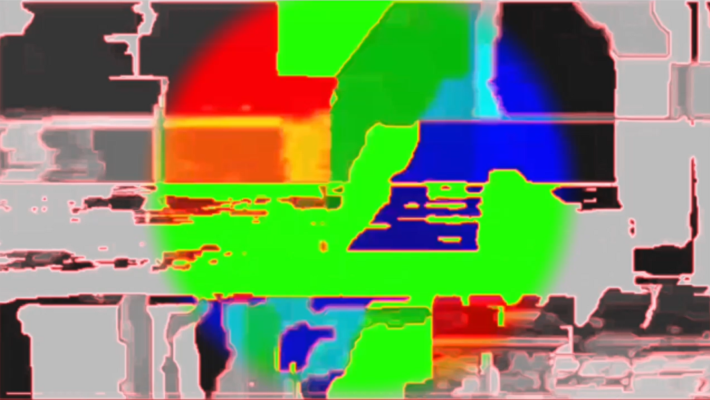
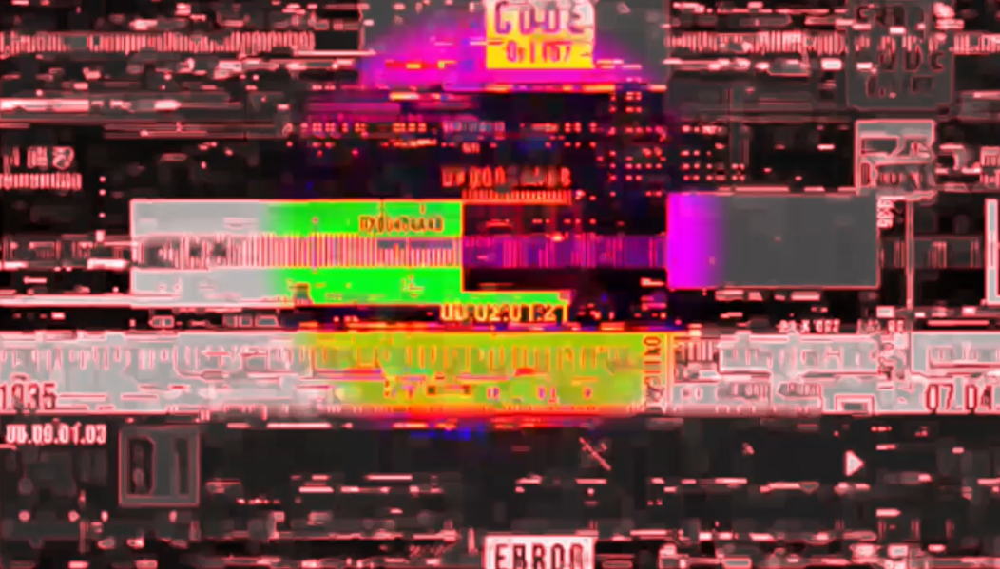

# PROJECT TITLE
When You Come Closer

## Short Description
This is an interactive installation based on TouchDesigner that uses facial tracking and gesture recognition to detect the distance between the viewer and the camera, responding to the viewer’s physical position with masks, visual glitches and sound variations. Here, social distancing is transformed into a dynamic visual and auditory landscape, turning the act of drawing near or moving away into a performance about psychological space.

## How to Run / Install
1. Install TouchDesigner
2. Download the project file
3. Open the .toe project file
4. Start the camera
5. Run the project and interact in front of the camera

Interaction methods:
Move your body forwards and backwards: The distance between your ears is used to determine proximity, switching between three mask and text states.
Move your hand closer to or further away from the camera: Control the playback status of the glitch visuals, the size of the coloured area, and the sound intensity.
Rotate your palm: Toggle between different TV glitch visual effects.
Pinch your thumb and index finger together: Adjust the size of the coloured circular area, whilst also affecting the sound intensity. 

## Screenshots / Media
*Screenshots of the visual effects*

## Credits / Acknowledgements
Authors:
Shiyu Lin: slin014@gold.ac.uk
Minhua Ren: mren002@gold.ac.uk

Tools: TouchDesigner, MediaPipe

Theoretical references:
Edward T. Hall — The Hidden Dimension (1966), a theory on social distance (proxemics).